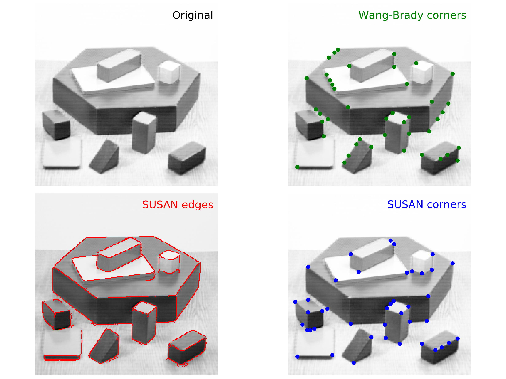
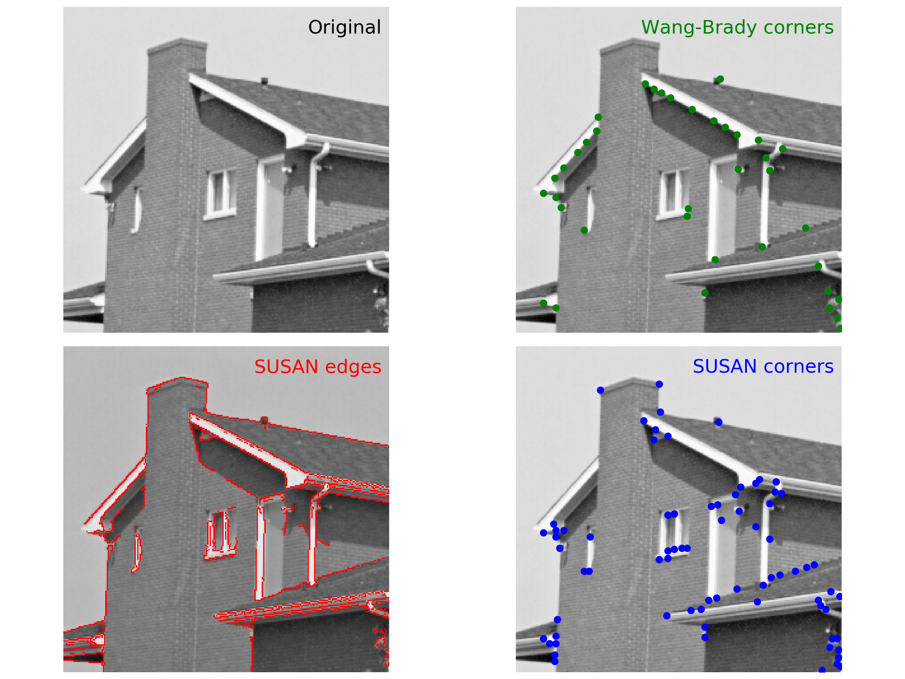

========
ftdetect
========

Python Image Feature Detection
------------------------------

This package implements a small assortment of (currently, three) algorithms related to computer vision and image feature detection:

    - Wang-Brady_ corner detection [WB1995]_
    - SUSAN_ edge detection [SB1995]_ [SB1997]_
    - SUSAN_ corner detection [SB1995]_ [SB1997]_

The code was originally developed using the EPD free Python 2.7.3 distribution (now offered as `Enthought Canopy Express`_) and has most recently been tested on Python 2.7.10 and 3.6.4.
      
.. _Wang-Brady: http://en.wikipedia.org/wiki/Corner_detection#The_Wang_and_Brady_corner_detection_algorithm
.. _SUSAN: http://en.wikipedia.org/wiki/Corner_detection#The_SUSAN_corner_detector
.. _Enthought Canopy Express:  https://www.enthought.com/downloads/

Screen Shots
------------

Typical output of the three algorithms looks like this:

Blocks
^^^^^^

House
^^^^^

Package Contents
----------------

The package is organized into four modules, briefly described below:

    **features**
        Contains the top-level end user functions which actually return the image features

        **.wangbrady()**: Implements Wang-Brady corner detection

        **.susanEdge()**: Implements SUSAN edge detection

        **.susanCorner()**: Implements SUSAN corner detection 

    **masks**
        Generates footprints and eventually passes them down into fast compiled DLL code in scipy.ndimage._ndimage.pyd, via functions in scipy.ndimage.filters module

        **.getDeriv()** Calculates first and second partial derivatives with respect to image grayscale brightness

        **.circFootprint()** Calculates pixel membership (within a square array) of pixels inside a circular footprint

        **.usan()** Calculates USAN response of each pixel in the image (see [SB1995]_ [SB1997]_ for details) 

    **cleanedges**
        Contains several functions to refine and remove noise from the raw response returned by edge detection algorithms 

        **.roundAngle()** Rounds edge normal direction angle to one of four major directions: horizontal, vertical, diagonal (positive slope) or diagonal (negative slope)

        **.nonMaxSuppEdge()** Suppresses edge responses from pixels which are not local maxima on a line segment along their local edge normal direction

        **.hystThresh()** Implements Canny style dual level hysteresis thresholding

        **.listEdge()** Assigns pixels with non-zero edge response into discrete groups based upon contiguity and also provides a list of member pixels of each group

        **.minMembership()** Rejects edges that consist of fewer than a minimum number of contiguous pixels

    **example**
        Demonstrates proper usage of the functions in the features module

        **.demo()** Runs the algorithms in the features module on a couple of standard test images (or user-supplied image files, if desired) using default parameter settings

Dependencies
------------

There are four external dependencies, all of which are very popular and widely used, and may be expected to install with no issues on practically any OS:

    - numpy_
    - scipy_
    - matplotlib_ (needed for demo script only)
    - Pillow_ (needed for demo script only)

.. _numpy:                     http://www.numpy.org/
.. _scipy:                     http://www.scipy.org/
.. _matplotlib:                http://matplotlib.org/
.. _Pillow:                    http://pillow.readthedocs.io/

Install
-------

The recommended way to the install the ftdetect package is from a `universal wheel`_, using pip::

    pip install ftdetect

.. _universal wheel:           https://packaging.python.org/tutorials/distributing-packages/#universal-wheels

If desired, the ftdetect package can also support distribution via Python's older legacy distribution system, setuptools_.  After downloading and unzipping the package, open a command line shell, change directory to the package folder that contains setup.py, and simply type::

    python setup.py install

.. _setuptools:                https://setuptools.readthedocs.io/en/latest/

Example
-------

A demo script has been provided in order to illustrate usage.  It reproduces the screen shots shown above.  To run it from the command line, type::

    python -c "import ftdetect.example; ftdetect.example.demo()"

To run it from an interactive Python session (IDLE, IPython, Enthought Canopy GUI, etc.), type::

    import ftdetect.example
    ftdetect.example.demo()

The demo script is also capable of running on user-selected figures, like so::

    ftdetect.example.demo(['filea.jpg', 'fileb.gif', 'filec.png'])

however, execution speed may vary widely.  The SUSAN algorithms in particular are prone to running very slowly on some images, particularly those with large dimensions, textured surfaces, or complicated fine structure.  If that happens, choose another image which is both smaller and doesn't contain as much fine detail.  Another more advanced option is to vary the algorithm input parameters so as to decrease the sensitivity.  However, the code in the example module is intended to be introductory, and therefore it simply accepts the default input settings for all algorithms.  If you want to modify the defaults, drill down further into the ``features`` module and read the docstrings, in order to understand what the parameters mean. 

References
----------

.. [WB1995] Han Wang and Michael Brady, "Real-time corner detection algorithm for motion estimation", Image and Vision Computing 13(9): 695-703 (Nov 1995). doi_: `10.1016/0262-8856(95)98864-P  <http://dx.doi.org/10.1016/0262-8856(95)98864-P>`_

.. [SB1995] S. M. Smith and J. M. Brady, `"SUSAN--A New Approach to Low Level Image Processing" <http://citeseerx.ist.psu.edu/viewdoc/summary?doi=10.1.1.24.2763>`_, Technical Report TR95SMSIc (1995).

.. [SB1997] S. M. Smith and J. M. Brady, "SUSAN--A New Approach to Low Level Image Processing", International Journal of Computer Vision 23(1): 45-78 (May 1997). doi_: `10.1023/A:1007963824710 <http://dx.doi.org/10.1023/A:1007963824710>`_

.. _doi: http://en.wikipedia.org/wiki/Digital_object_identifier

Package Maintenance Information
-------------------------------

*Version*: 1.0.1

*Date*: 2018-01-18

*URL*: https://github.com/stachyra/ftdetect

*Author*: Andrew L. Stachyra

*Contact*: andrewlstachyra@gmail.com
